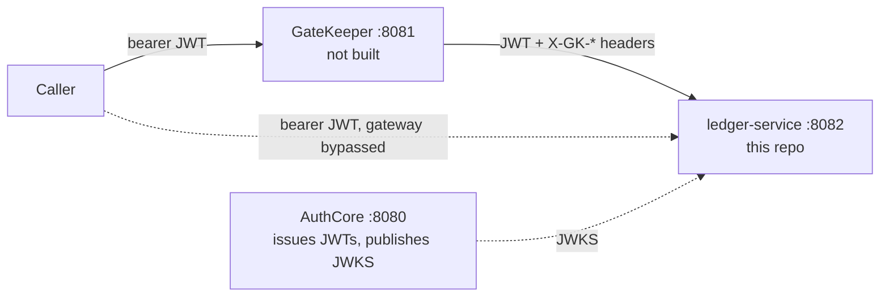

# ledger-service

A Spring Boot resource server holding ledger data — journal entries with a reference, a tenant, an amount, and a currency. It is the third service in a small OAuth2 platform built to be opened and prodded by a hiring interviewer: **AuthCore** (`:8080`) issues the tokens, **GateKeeper** (`:8081`) is the platform's planned zero-trust edge, and this service (`:8082`) owns the ledger data and decides, on every request, whether the caller may see or change it.

GateKeeper does not exist yet. There is no gateway running anywhere in this platform today, and that isn't a gap this README is glossing over — it's the reason this service is built the way it is.

The one idea worth understanding before anything else here: **ledger-service verifies AuthCore's JWTs itself, and it never trusts the gateway.** Point `curl` at `:8082` directly, skipping GateKeeper entirely — unavoidable right now, since GateKeeper isn't built — and the service is exactly as secure as it would be behind ten gateways. It reads the `X-GK-Subject`, `X-GK-Tenant`, and `X-GK-Permissions` headers GateKeeper's design says it will stamp, and one endpoint even reports them back for inspection, but nothing here is ever authorized on their say-so. They are informational. Every other decision in this service — what a caller can read, what they can write, what counts as proof of identity — follows from that one sentence.

**Stack:** Java 21 · Spring Boot 4.1 · Spring Security OAuth2 Resource Server · in-memory storage

---

## Contents

- [Platform](#platform)
- [Running it](#running-it)
- [Endpoints](#endpoints)
- [The whoami walkthrough](#the-whoami-walkthrough)
- [Tenant isolation](#tenant-isolation)
- [Testing](#testing)
- [Known limitations](#known-limitations)
- [Why a servlet, not reactive](#why-a-servlet-not-reactive)

---

## Platform

| Service | Owns |
|---|---|
| **AuthCore** `:8080` | Authenticating users, issuing and signing JWTs, publishing JWKS |
| **GateKeeper** `:8081` — *not built* | Routing, rate limiting, edge rejection — a coarse first layer |
| **ledger-service** `:8082` — this repo | Owning ledger data, and enforcing fine-grained authorization over it |



The bottom row of the table and the dashed arrow in the diagram are the same point twice. ledger-service does not ask an upstream layer "did you already decide this?" — there's no channel for that question, and nothing here would trust the answer if there were. It re-verifies the token's signature against AuthCore's published keys, re-derives the caller's tenant and permissions from the token's own claims, and re-checks both on every request, independent of whatever a gateway in front of it may already have concluded.

---

## Running it

Requires Java 21.

```bash
git clone https://github.com/ezat141/ledger-service.git
cd ledger-service
./mvnw.cmd spring-boot:run        # .\mvnw.cmd in PowerShell
```

The service listens on `:8082`. `application.yml` points it at AuthCore's JWKS for verifying tokens:

```yaml
spring.security.oauth2.resourceserver.jwt.jwk-set-uri: http://localhost:8080/oauth2/jwks
```

but **the application starts fine with AuthCore not running at all.** Spring builds the JWT decoder lazily — it fetches nothing at startup, only on the first request that actually needs a signature checked. On a clean run here, with AuthCore never started:

```
Started LedgerServiceApplication in 1.947 seconds
```

No JWKS call attempted, no error. Every test in this repository leans on the same behaviour: they all point `jwk-set-uri` at `http://localhost:9999/jwks`, an address nothing answers, and the context boots regardless because nothing ever calls it.

Two unauthenticated requests against that same instance, to make the point concrete:

```bash
curl.exe -i http://localhost:8082/actuator/health
```
```
HTTP/1.1 200
Content-Type: application/vnd.spring-boot.actuator.v3+json

{"groups":["liveness","readiness"],"status":"UP"}
```

```bash
curl.exe -i http://localhost:8082/ledger/entries
```
```
HTTP/1.1 401
WWW-Authenticate: Bearer resource_metadata="http://localhost:8082/.well-known/oauth-protected-resource"
Content-Length: 0
```

`/actuator/health` is permitted explicitly in `ResourceServerConfig`; everything else demands a token, gateway or no gateway.

---

## Endpoints

| Endpoint | Requirement |
|---|---|
| `GET /ledger/entries` | authenticated; returns **only** the caller's `tenant` |
| `POST /ledger/entries` | `hasAuthority('payments:write')` **and** a present `tenant` claim |
| `GET /ledger/whoami` | authenticated |

`NewEntryRequest` — the POST body — carries a `reference`, an `amount`, and a `currency`. There is no `tenant` field for a caller to fill in. The tenant on every written entry is whatever the verified token says; the request body has no way to specify one, so there's no field to sanitize and nothing to write an entry into someone else's tenant with.

---

## The whoami walkthrough

`GET /ledger/whoami` is the centrepiece of this service: it answers "who does this service think I am?" twice — once from the token it verified itself, once from the `X-GK-*` headers on the request — and reports whether the two agree, without ever refusing to answer.

### 1. Called directly, no gateway in front

```
GET /ledger/whoami
Authorization: Bearer <token, sub=ezzat, tenant=acme>
```

```json
{"fromToken":{"subject":"ezzat","tenant":"acme","permissions":[]},"fromHeaders":{"subject":null,"tenant":null,"permissions":[]},"match":false}
```

No `X-GK-*` header arrived, because nothing sent one. `fromHeaders` comes back empty and `match` is `false`.

### 2. What a gateway would send, added by hand

GateKeeper isn't built, so today the only way to see this shape is to attach the headers its design says it will stamp:

```
GET /ledger/whoami
Authorization: Bearer <token, sub=ezzat, tenant=acme>
X-GK-Subject: ezzat
X-GK-Tenant: acme
```

```json
{"fromToken":{"subject":"ezzat","tenant":"acme","permissions":[]},"fromHeaders":{"subject":"ezzat","tenant":"acme","permissions":[]},"match":true}
```

### 3. Headers forging privileges the token does not grant

```
GET /ledger/whoami
Authorization: Bearer <token, sub=ezzat, tenant=acme, permissions=[payments:read]>
X-GK-Subject: ezzat
X-GK-Tenant: acme
X-GK-Permissions: payments:read,payments:write,admin:all
```

```json
{"fromToken":{"subject":"ezzat","tenant":"acme","permissions":["payments:read"]},"fromHeaders":{"subject":"ezzat","tenant":"acme","permissions":["payments:read","payments:write","admin:all"]},"match":false}
```

This third case is why `match` compares subject, tenant, **and** permissions, instead of stopping at the first two. Subject and tenant agree here — a comparison that stopped there would report `match: true` on a request whose headers claim `admin:all` while the token grants nothing of the sort. That would be exactly backwards on the one endpoint that exists to prove headers aren't authoritative: it would teach the opposite lesson. Permissions are compared as **sets**, not lists — `X-GK-Permissions` is a comma-joined string with no meaningful order, so the same permissions arriving in a different sequence still have to count as a match, which a dedicated test pins down.

`match: false` has two different causes, and the response body is how you tell them apart:

- **No headers arrived at all** — case 1 above. `fromHeaders` is entirely empty: `subject` and `tenant` both `null`, `permissions` `[]`.
- **Headers arrived and disagreed** — case 3, or a plain subject/tenant mismatch. `fromHeaders` is populated, just not with the same values as `fromToken`.

Both render as `"match":false`; only the contents of `fromHeaders` say which one actually happened.

---

## Tenant isolation

Reads are scoped to the caller's `tenant` claim; writes require it outright.

```java
public List<LedgerEntry> findByTenant(String tenant) {
    if (tenant == null || tenant.isBlank()) {
        return List.of();
    }
    return entries.stream().filter(entry -> tenant.equals(entry.tenant())).toList();
}
```

The seed data spans two tenants — two entries under `acme`, one under `default` — so a caller only ever sees their own slice, never the other tenant's.

A client-credentials token carries **no** `tenant` claim, because AuthCore only writes that claim for a token issued to an actual user, and client credentials have no user behind them. Such a caller hits both endpoints and gets two different answers:

- **Read:** an empty list, `200`.
- **Write:** refused, `403`.

That asymmetry is deliberate, not an inconsistency to clean up later. A tenant-less *read* has a truthful default: an empty list looks exactly like "your tenant has nothing in it yet," which is a legitimate state for a real tenant to be in. A tenant-less *write* has no honest default at all — storing it would create a row with no tenant to scope it to, which every tenant-scoped read would then skip forever, unreadable by any caller, including whoever just wrote it. Returning `201` for that would be a lie in a way that returning an empty list for the read is not.

---

## Testing

```bash
./mvnw.cmd test        # .\mvnw.cmd in PowerShell
```

22 tests, no external dependencies — everything runs against an in-memory Spring context and a mocked JWT principal, so there's no Docker requirement here the way there is for AuthCore.

| Class | Tests | Covers |
|---|---|---|
| `AuthCoreAuthoritiesConverterTest` | 4 | `scope`/`roles`/`permissions` claims become authorities correctly, including a space-delimited `scope` string, roles not getting double-`ROLE_`-prefixed, and a claims-free token producing no authorities rather than failing |
| `ResourceServerConfigTest` | 2 | No token is refused; `/actuator/health` is not |
| `LedgerControllerTest` | 6 | Tenant isolation in both directions — two different tenants see two disjoint sets — a missing-tenant token seeing nothing on read and refused on write, and the `payments:write` gate on the write path |
| `WhoAmITest` | 9 | All three walkthrough cases above, headers alone never authenticating a request, the forged-permissions mismatch, and that permission order and header whitespace don't affect the comparison |
| `LedgerServiceApplicationTests` | 1 | The Spring context loads |

Run against the current source, that's `Tests run: 22, Failures: 0, Errors: 0, Skipped: 0`.

Worth noticing the contrast between two "missing tenant" tests in different classes: `LedgerControllerTest` fails closed on a missing tenant — nothing on read, `403` on write. `WhoAmITest` deliberately does the opposite for the same missing claim — it reports the absence rather than refusing, because refusing would blind the one endpoint whose job is diagnosing identity. Same input, two different correct answers, because the two endpoints are answering different questions.

---

## Known limitations

Honest about what this demo does not do:

- **No input validation.** A null or absent `reference`, a null `amount`, a negative amount, an amount of `10^39`, and a currency of `NOT_A_CURRENCY` are all accepted with `201`; a repeated `reference` simply creates a second row. Deliberate scope, not an oversight — the milestone this service demonstrates is the trust boundary at the edge, and closing this one needs a validation dependency this project doesn't pull in yet, plus a decision about what an error response should look like.
- **`BigDecimal` serialises as a bare JSON number.** Harmless JVM-to-JVM, but a precision hazard for any consumer whose JSON layer parses numbers into IEEE-754 doubles rather than an arbitrary-precision type.
- **The storage record doubles as the wire type.** `LedgerEntry` is both what `LedgerRepository` holds and what the controller returns — there's no DTO seam between them.
- **Both `403` paths return an empty body labelled `insufficient_scope`.** That label is actively misleading for the missing-tenant write: the caller already holds `payments:write`, and no larger scope would supply a `tenant` claim the token simply doesn't carry. Left as-is until the platform settles on a shared error-response shape.
- **In-memory storage.** Three seed rows, reset on every restart. No database.
- **A repeated header is comma-joined before this service ever sees it**, so sending `X-GK-Subject` twice yields `"ezzat,admin"` rather than an error. Harmless today, since nothing authorizes on that header, but it's visible in a `whoami` body if it happens.

---

## Why a servlet, not reactive

Spring MVC on a blocking Tomcat, not WebFlux. This is an ordinary CRUD-shaped microservice with no high-fan-out I/O to justify a reactive stack, and reaching for one anyway would add a second programming model to hold in your head — `Mono`/`Flux`, non-blocking security context propagation — without demonstrating anything that GateKeeper, an actual I/O-bound gateway, won't already demonstrate better once it exists.
